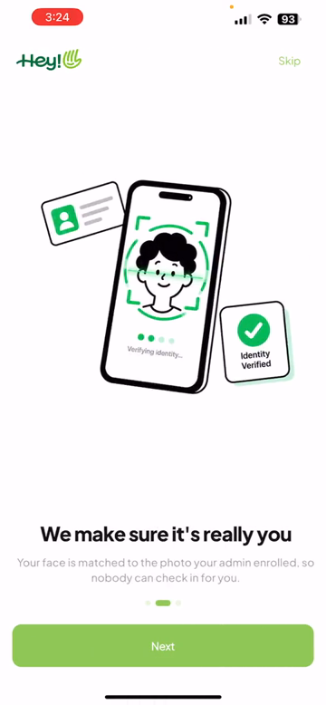

# SalaryBox Attendance App

A two-role attendance app. An **admin** adds staff and enrols their faces; **staff** mark their own attendance with a selfie that must match their enrolled face. Location and time are captured automatically at the moment of marking.

- **Frontend** — Flutter, built for Android (the assignment's target); developed and tested on an iPhone. In `frontend/`
- **Backend** — Node.js + Express API, in `backend/`, deployed on Vercel
- **Data** — Supabase (Postgres for records, Storage for photos)

Face detection (Google ML Kit) and face matching (bundled MobileFaceNet TFLite model) both run **on the phone**. The backend never sees a photo and decides who it is — it stores what the app already decided. See [`backend/ARCHITECTURE.md`](backend/ARCHITECTURE.md) and [`frontend/ARCHITECTURE.md`](frontend/ARCHITECTURE.md) for the design.

```
Flutter app ──REST/JSON──▶ Express API (Vercel) ──supabase-js──▶ Supabase (Postgres + Storage)
```

## Demo

<a href="docs/demo.mp4"></a>

**[▶ Watch the 1-minute demo](docs/demo.mp4)** — screen recording on an iPhone: login, adding a staff member, and marking attendance with the head-turn face check, ending on the check-in confirmation.

## Demo credentials

| Role  | Username                   | Password   |
| ----- | -------------------------- | ---------- |
| Admin | `admin`                    | `admin123` |
| Staff | the staff member's **Employee ID** | `staff123` |

- The admin account is seeded by `backend/db/schema.sql`.
- There is no seeded staff. Log in as admin, add a staff member (name + Employee ID), enrol their face, then log in on the same or another device with that Employee ID and `staff123`.
- Every staff member shares the one password (`STAFF_DUMMY_PASSWORD`, defaults to `staff123`).

## Live backend

`https://salarybox-backend.vercel.app` — check it with `GET /health` (returns `{"ok":true}`).

The app's default API URL (`frontend/lib/config/env.dart`) already points here, so you can run or build the app without running the backend yourself.

## Run it locally

This is the path for someone who was sent the project's **`.env` file**. You run the backend on your own machine and the Flutter app on an Android emulator or phone. The `.env` points at the owner's Supabase project, which is already set up (tables, admin user and storage buckets exist), so there is no database setup.

### What you need installed

| Tool                          | Version     | Check it with       |
| ----------------------------- | ----------- | ------------------- |
| Git                           | any         | `git --version`     |
| Node.js                       | 18.11+      | `node -v`           |
| Flutter                       | 3.41+       | `flutter --version` |
| Android SDK + an emulator or an Android phone | — | `flutter doctor` (the "Android toolchain" line must have a ✓) |

### Step 1. Get the code

```bash
git clone https://github.com/Ansh-bhamniya/salarybox-assignment.git
cd salarybox-assignment
```

### Step 2. Put the `.env` file in `backend/`

The file must end up at exactly `backend/.env`.

```bash
# macOS / Linux
cp /path/to/the/.env backend/.env

# Windows (PowerShell)
Copy-Item C:\path\to\the\.env backend\.env
```

- The name is `.env` — not `env.txt`, not `.env.local`, not a folder containing it. If it arrived under another name, rename it. Only `.env` is read.
- The file starts with a dot, so Finder and File Explorer hide it. On macOS press `Cmd+Shift+.` to show hidden files.
- Check: `ls -a backend` (Windows: `dir backend -Force`) lists `.env`.

### Step 3. Start the backend

```bash
cd backend
npm install
npm run dev
```

You should see `Attendance backend listening on port 4000`. Leave this terminal open; the backend stops when you close it.

If it exits with `Missing required env var: ...`, the `.env` is missing, misnamed, or in the wrong folder — go back to step 2.

### Step 4. Check the backend works

Open a **second terminal** and run:

```bash
curl http://localhost:4000/health
# expected: {"ok":true}

curl -X POST http://localhost:4000/auth/login \
  -H "Content-Type: application/json" \
  -d '{"username":"admin","password":"admin123"}'
# expected: JSON containing "role":"admin" and a "token"
```

If the second command returns an error instead, the `.env` values are wrong or the Supabase project is unreachable; do not continue to step 5.

### Step 5. Run the app

Still in the second terminal:

```bash
cd frontend
flutter pub get
```

Then pick one.

**A. Android emulator**

1. Start an emulator (Android Studio → Device Manager → ▶ next to a device, or `flutter emulators --launch <emulator id>`; list ids with `flutter emulators`).
2. Give the emulator a camera and a location, because attendance needs both:
   - Camera: in the emulator's settings (Device Manager → ✎ edit → Show Advanced Settings), set **Front camera** to `Webcam0`, then cold-boot the emulator.
   - Location: emulator side bar `⋮` → **Location** → pick a point → **Send**.
3. Run the app. `10.0.2.2` is how the emulator reaches your computer's `localhost`:

   ```bash
   flutter run --dart-define=API_BASE_URL=http://10.0.2.2:4000
   ```

**B. Physical Android phone**

1. Enable USB debugging on the phone (Settings → About phone → tap **Build number** 7 times → Developer options → **USB debugging**), connect it by USB and accept the prompt on the phone. `flutter devices` must list it.
2. Connect the phone to the **same Wi-Fi** as your computer and find the computer's Wi-Fi address:

   ```bash
   ipconfig getifaddr en0      # macOS
   hostname -I                 # Linux
   ipconfig                    # Windows: use the "IPv4 Address" of the Wi-Fi adapter
   ```

3. Check the phone can reach the backend: open `http://<that address>:4000/health` in the phone's browser. It must show `{"ok":true}`. If it doesn't, allow incoming connections on port 4000 in your computer's firewall.
4. Run the app, replacing `192.168.1.23` with your address:

   ```bash
   flutter run --dart-define=API_BASE_URL=http://192.168.1.23:4000
   ```

The first build downloads Gradle dependencies and can take several minutes. Allow the **camera** and **location** permissions when the app asks.

`flutter run` builds a debug app, which is allowed to use plain `http://` (enabled in `frontend/android/app/src/debug/AndroidManifest.xml`). A release APK is not, so it needs an `https://` backend. Local `http://` is not set up for iOS.

### Step 6. Try it

1. Log in with **`admin`** / **`admin123`**.
2. Tap **Add staff**, enter a name and an Employee ID (for example `1234`), then **Next: Enrol face**.
3. Follow the on-screen prompts to take the three enrolment photos of the person's face.
4. Log out. Log in with that **Employee ID** and password **`staff123`**.
5. Tap **Mark attendance**. Hold the face inside the oval, turn your head to each side when told, then look straight at the camera. A match records the time and your location.
6. Log out, log in as admin again, open the staff member: the attendance record (photo, date, time, latitude/longitude) is listed.

### If something goes wrong

| What you see | Cause and fix |
| --- | --- |
| `Missing required env var: ...` when starting the backend | `.env` is not at `backend/.env`, is misnamed, or is incomplete. Redo step 2. |
| `EADDRINUSE` when starting the backend | Port 4000 is taken. Add `PORT=4001` on a new line in `backend/.env`, restart, and use `4001` in every URL below. |
| App shows a network or "can't connect" error | The backend is not running, or the URL is wrong. Emulator: it must be `http://10.0.2.2:4000` (not `localhost`). Phone: it must be your computer's Wi-Fi address, the phone must be on the same Wi-Fi, and `http://<address>:4000/health` must open in the phone's browser. |
| `Invalid credentials` | Admin is `admin` / `admin123`. Staff use their Employee ID with `staff123`, and the staff member must already have been added by the admin. |
| Mark attendance is disabled or says not enrolled | The admin has not enrolled that staff member's face yet (step 6, items 2–3). |
| Face check keeps failing | Better light, face centred in the oval. To see the raw match score while testing, run the app with `--dart-define=SHOW_MATCH_SCORE=true` added to the `flutter run` command. |
| `flutter run` asks which device to use, or picks the wrong one | Add `-d <device id>` (ids from `flutter devices`). |

**Good to know:** your local backend reads and writes the **owner's** Supabase project — the same data the live backend uses — so staff, enrolments and attendance you create show up there. The `.env` contains a Supabase service role key with full access to that project: keep it private, and never commit it (`backend/.gitignore` already ignores `.env*`).

## Other ways to run

### Run the app against the live backend (no `.env`, no backend on your machine)

```bash
cd frontend
flutter pub get
flutter run
```

The app's default API URL (`frontend/lib/config/env.dart`) already points at the live backend. Log in with the demo credentials above. The camera and location permissions are requested on first use, so use a device or emulator with a working camera (and a location set, on the emulator).

### Build a release APK

```bash
cd frontend
flutter build apk --release
```

Output: `frontend/build/app/outputs/flutter-apk/app-release.apk`. Copy it to a phone and install it. It is signed with the debug key, which is fine for sideloading.

To target a different backend, override the URL at build or run time:

```bash
flutter build apk --release --dart-define=API_BASE_URL=https://your-backend.example.com
```

### Run the backend against your own Supabase project

Use this if you do not have the shared `.env`. Then run the app as in step 5 above.

**a. Set up Supabase**

1. Create a Supabase project.
2. In the SQL editor, run [`backend/db/schema.sql`](backend/db/schema.sql). It enables the `vector` (pgvector) extension, creates the tables (`users`, `staff`, `face_templates`, `attendance`, `attendance_attempts`, `audit_log`) and the enrolment functions, turns on row level security, and seeds the admin user. It is safe to re-run, so run it again to upgrade an existing project — it also backfills existing enrolments into `face_templates`.
3. In Storage, create two **public** buckets: `enrollment-photos` and `attendance-selfies`.

**b. Configure and start the API**

```bash
cd backend
cp .env.example .env      # then fill in the values below
npm install
npm run dev               # http://localhost:4000
```

| Variable                    | Required | Notes                                              |
| --------------------------- | -------- | -------------------------------------------------- |
| `SUPABASE_URL`              | yes      | Project URL from Supabase settings                 |
| `SUPABASE_SERVICE_ROLE_KEY` | yes      | Server-side only — never put this in the app       |
| `JWT_SECRET`                | yes      | Any long random string                             |
| `STAFF_DUMMY_PASSWORD`      | no       | Shared staff password, defaults to `staff123`      |
| `DUPLICATE_FACE_THRESHOLD`  | no       | Cosine similarity (0–1] at which a face being enrolled counts as "already enrolled under someone else"; defaults to `0.6` |
| `LIVENESS_REQUIRED`         | no       | `true` refuses attendance that doesn't carry a passed head-turn check (409 `liveness_required`). Off by default so older app builds keep working |
| `ATTEMPTS_PER_HOUR`         | no       | How many failed-check reports one staff member may log per hour; defaults to `60` |
| `PORT`                      | no       | Defaults to `4000`                                 |

`.env.example` also lists `DATABASE_PASSWORD`; the server does not read it.

### Deploy the backend to Vercel

The project is set up for Vercel: `backend/api/index.js` exports the Express app as a serverless function and `backend/vercel.json` routes every path to it.

1. Import the repo in Vercel and set **Root Directory** to `backend`.
2. Add `SUPABASE_URL`, `SUPABASE_SERVICE_ROLE_KEY` and `JWT_SECRET` as environment variables.
3. Deploy. Pushes to `main` redeploy automatically.

Use the project's production domain (`<project>.vercel.app`) in the app, not a per-deployment URL — those can sit behind Vercel's login wall.

### Tests and analysis

```bash
cd frontend
flutter analyze
flutter test

cd ../backend
npm test
```

The backend tests cover input validation and error responses; they don't need a database. The API's database paths (enrolment, the not-enrolled refusal) are not covered by automated tests.

## How it works

1. **Admin** logs in → **Staff list** → **Add staff** (name + Employee ID).
2. **Face enrolment:** the front camera takes three photos (straight, slightly left, slightly right). For each, ML Kit detects and crops the face and the TFLite model produces an embedding; the photos and embeddings are uploaded together. The stored embedding for each photo is the average of the last few live camera frames of the hold (the photo itself is a still), because the same face scores about 0.2 lower between a still and a live frame, and attendance checks compare live frames. If the face already belongs to another staff member the server refuses, and the admin can override with a reason that is audited.
3. **Staff** logs in with their Employee ID → **Mark attendance:** there is no shutter. The person turns their head to one side, then the other (in a random order each time), then looks straight, while the live camera is watched. Frames from that check itself are kept — before the turns, at each turn, and at the end. The final straight frame must match the person's enrolled faces (fetched fresh from the backend; best score across their templates), and the other frames must be the same face as it, so whoever did the turns is who gets recorded. Only then are GPS location and time captured and the record uploaded, with the final frame as the photo and a summary of what the check saw. A check that fails can be retried with a new challenge as many times as needed; there is no lockout. Every failed check is reported to the backend.
4. **Admin** opens a staff profile to see their history: selfie, date, time, and latitude/longitude for each record. From the profile the admin can also delete the staff member (after a confirmation that says what goes with them).

### API

| Method | Path                     | Who            | Purpose                                 |
| ------ | ------------------------ | -------------- | --------------------------------------- |
| POST   | `/auth/login`            | anyone         | Returns a JWT (12 h) and the role       |
| GET    | `/staff`                 | admin          | List staff (each with an `enrolled` flag) |
| POST   | `/staff`                 | admin          | Create staff                            |
| GET    | `/staff/:id`             | admin, or self | Profile including the active face templates |
| POST   | `/staff/:id/enroll`      | admin          | Upload 1–5 captures: `photos` + `embeddings` (+ `modelVersion`, `reason`, `allowDuplicate`). 409 `duplicate_face` if the face matches another staff member. The original single `photo` + `embedding` form is still accepted |
| GET    | `/staff/:id/attendance`  | admin, or self | Attendance history                      |
| DELETE | `/staff/:id`             | admin          | Delete a staff member for good: profile, all face templates, attendance and failed-attempt records, and their stored photos and selfies. Recorded in the audit log. 204 on success |
| POST   | `/attendance`            | staff (self)   | Record attendance (multipart selfie, plus an optional `liveness` JSON: what the head-turn check saw). 409 `not_enrolled` if the person has no active face; 409 `liveness_required` if the server requires the check and none was sent |
| POST   | `/attendance/attempts`   | staff (self)   | Report a failed check: `outcome` (`liveness_failed` or `no_match`) and an optional short `reason`. Capped per hour |

## Assumptions and limitations

**Auth and security**

- Login is dummy by design, as the assignment allows. Passwords are stored and compared in plain text, and all staff share one password, so anyone who knows an Employee ID can log in as that person. There is no signup, password reset, or rate limiting.
- Uploaded photos are stored in public Supabase buckets. The URLs are random but not access-controlled.
- Deleting a staff member is permanent (no undo, no soft delete). The audit log keeps who deleted whom and how many records went. Stored pictures are removed from the buckets straight away, but Supabase's CDN may keep serving a cached copy of a public URL for up to an hour.
- The server trusts the app's match decision. It does not re-verify the face, so a modified client could submit a fake record.

**Face matching**

- Attendance needs a **head-turn check** (turn left and right in a random order, then look straight), which a still photo — printed or on another screen — cannot pass, and neither can a photo that is rotated like a head (the nose does not move against the eyes). It does **not** stop a video replay of the person turning, a 3D mask, or a modified app. The check runs on the phone: the server stores what the app says it saw (`attendance.liveness`) and can require it (`LIVENESS_REQUIRED`), but cannot verify the claim. Stopping those needs a passive anti-spoof model and server-side verification with app attestation, which are not built.
- The head-turn check was measured and tuned on an **iPhone only**. The direction rule comes from face geometry so it should carry over, but Android's frame format and mirroring have not been verified on a device. The thresholds are provisional until tested against real attacks.
- The match threshold (`0.55` cosine similarity, in `frontend/lib/config/env.dart`) was calibrated offline on public LFW photos, not on real enrolment/selfie pairs from this app. Expect to tune it. Build with `--dart-define=SHOW_MATCH_SCORE=true` to show the raw score on the result screen while calibrating.
- **What was measured** (one iPhone, one enrolled person, so a small sample): with templates made from still photos, check-ins scored 0.44–0.70 against the 0.55 threshold and roughly half of genuine attempts in varied light were rejected. The cause is that a still and a live camera frame of the same face score about 0.2 lower against each other than two live frames do. Enrolment templates are therefore now built from live frames (see *How it works*); after that change the one check recorded so far scored 0.97, but there are too few attempts to quote a reliable pass rate. Not done on a device: attacks with a printed photo, a tilted photo or a photo swapped in after the turns, and attempts by a second person. The threshold has not been tuned against impostor scores.
- Each person is enrolled from three photos and matched against all of them (best score wins). Re-enrolling replaces the whole set; the old templates are kept, marked revoked, with a reason and an audit entry. Templates never update themselves from later selfies, and staff are not notified when they are re-enrolled.
- Duplicate-face detection compares a new enrolment with everyone else's active templates (pgvector, same face-model version only). Its threshold (`DUPLICATE_FACE_THRESHOLD`, default 0.6) is a provisional guess until calibrated on real photos, so it can miss a match or flag a lookalike; an admin can override a flag with a reason. Two enrolments of the same face at the very same moment could both slip through.
- Staff can't mark attendance until an admin has enrolled their face. The app disables the button, and the server also refuses the record (409 `not_enrolled`) and logs the attempt.

**Location and time**

- Location is a single GPS reading (high accuracy, 15 s timeout) taken when the face matches. There is no geofence, and mock or spoofed locations are not detected. Location services must be on.
- The date and time saved in the database are the capture moment in **UTC**. The app displays them in the device's local time, but the raw `date` column can differ from the local date near midnight.
- The backend does not limit attendance to once per day; repeated marks create repeated records.

**Platform and infrastructure**

- Attendance marking needs a network connection. There is no offline queue or retry.
- Built for Android, but all on-device testing was done on an **iPhone**. The release APK compiles and the Android camera-frame code is unit-tested, but it has **not been run on an Android device**, so the head-turn check on Android is unverified.
- Vercel rejects request bodies over 4.5 MB (the API itself allows 8 MB). Selfies are JPEG-encoded by the app and should be well below this, but their size hasn't been measured — very large images would fail.
- The release APK is signed with the debug key, not a Play Store signing key.

**Out of scope**

Editing staff, editing attendance records, multiple admin accounts, push notifications, offline sync, forgot-password, and pagination (lists are loaded in full).
